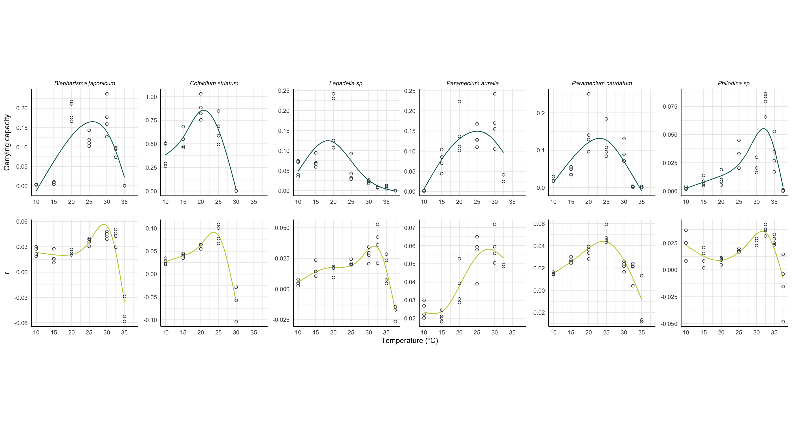

## Temperature response curves 

## Introduction

Data on the temperature responses of protist species used in the Experimental Ecology & Conservation group. Experiments carried out in 2022 by Ellie Wolfe. 

# Temperature responses

# Data structure

Some stuff here

# Authors

Experiments carried out in 2022 by Ellie Wolfe. Code written by Ellie Wolfe and Chris Clements. 